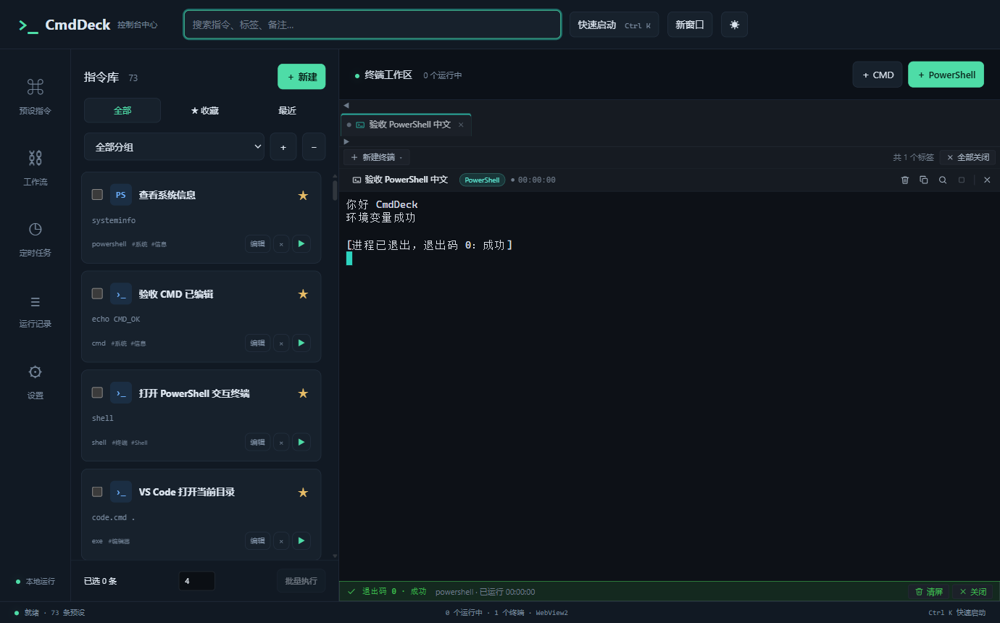

# CmdDeck

[](https://github.com/jgbrzzh/CmdDeck/actions/workflows/windows.yml)
[](LICENSE)

Windows 控制台集中管理中心。把常用指令保存为预设，在一个工作台中启动、查看输出和管理多个终端。

**中文界面、默认暗色、本地 SQLite、Windows WebView2。**

[应用图标与重新生成](docs/ICON.md)



## 功能

- 预设新建、编辑、删除，工作目录、环境变量、参数、图标、分组、标签、备注和收藏。
- PowerShell、CMD、Python、Node.js 和自定义 exe；运行前填写 `{{name}}` 等参数。
- Python / Node 环境管理：检测 Conda、项目 `.venv` / `venv`、Python 启动器和 Node 安装；预设可以绑定环境，定时任务与工作流复用同一绑定。
- 调用现有 Conda、Python venv、uv、npm / pnpm / yarn 与 fnm / nvm / Volta，查看包、创建环境、安装包或 Node 版本，操作输出进入内嵌终端。
- ConPTY + xterm.js 内嵌终端，多标签并发、交互输入、实时输出、停止、清屏、搜索、复制和退出码。
- 顶部搜索、收藏、最近使用、拖拽排序、`Ctrl+K` 快速启动。
- 默认全局快捷键 `Ctrl+Shift+Space`，托盘、开机启动、暗色 / 亮色主题和多窗口。
- 批量并发、串行 / 并行工作流、成功 / 失败条件步骤、间隔 / 每天 / 每周 / 单次定时任务。
- SQLite 自动迁移、JSON 配置导入导出、危险命令确认、黑名单、审计日志和终端历史。
- 首次启动引导、示例预设、Windows `.exe` / `.msi` 安装包。

## 下载和安装

到 [Releases](https://github.com/jgbrzzh/CmdDeck/releases) 下载带版本号的安装包。尚未发布版本时，可从 [Actions](https://github.com/jgbrzzh/CmdDeck/actions/workflows/windows.yml) 的成功构建中下载 `CmdDeck-windows-x64` artifact（需登录 GitHub）。

安装包包含 CmdDeck，用户无需安装 Node.js、Rust 或 SQLite。运行 Python / Node 预设时，需要本机另有对应解释器。WebView2 缺失时安装器会下载 Evergreen 引导程序，需要联网。

安装包目前未代码签名。发布页附 `SHA256SUMS.txt`，可用以下命令检查文件哈希：

```powershell
Get-FileHash .\CmdDeck_1.1.0_x64-setup.exe -Algorithm SHA256
```

## 从源码一键安装、运行和打包

要求 Windows 10 1809+ 或 Windows 11 x64。界面使用系统 WebView2；不内置另一套 Chromium。构建环境需要 Node.js 24 LTS、Rust stable MSVC、Visual Studio 2022 C++ Build Tools 和 Windows SDK。

在 PowerShell 中运行（将路径替换为你的克隆目录）：

```powershell
git clone https://github.com/jgbrzzh/CmdDeck.git
Set-Location .\CmdDeck

# 首次准备开发环境；安装过程可能出现系统权限提示
powershell -NoProfile -ExecutionPolicy Bypass -File .\scripts\Setup.ps1 -InstallPrerequisites
```

安装完成后重新打开 PowerShell：

```powershell
Set-Location D:\Github\CmdDeck
powershell -NoProfile -ExecutionPolicy Bypass -File .\scripts\Setup.ps1
powershell -NoProfile -ExecutionPolicy Bypass -File .\scripts\Start.ps1
```

打包 EXE 和 MSI：

```powershell
Set-Location D:\Github\CmdDeck
powershell -NoProfile -ExecutionPolicy Bypass -File .\scripts\Build.ps1 -Target all
```

只打 EXE 用 `-Target exe`，只打 MSI 用 `-Target msi`。产物在 `src-tauri\target\release\bundle\nsis` 和 `src-tauri\target\release\bundle\msi`。

等价的手动命令：

```powershell
npm ci
npm run tauri:dev
# 开发窗口关闭到托盘后，请从托盘退出再重新构建
npm run tauri:build
```

`npm run dev` 仅预览网页，不具备本地终端执行能力；完整桌面程序使用 `npm run tauri:dev`。

## 使用方法

1. 左侧新建预设，选择执行类型。CMD / PowerShell 的命令栏填完整脚本；Python / Node 可以留空程序栏，在参数中每行填一个参数。
2. 例如 PowerShell 命令：`Write-Output "你好 {{name}}"`。运行时会弹出 `name` 输入框。
3. Python 参数可分别填 `-c` 和 `print("Hello")`；Node 参数可分别填 `-e` 和 `console.log("Hello")`。
4. 自定义 exe 填可执行文件路径，在设置中开启自定义 exe 权限。工作目录可留空；环境变量每行使用 `KEY=VALUE`。
5. 双击预设或点击 ▶ 启动；输出在右侧终端显示。多个任务分别占用标签页，停止后保留输出和退出码。
6. 拖动预设卡片排序；勾选多个预设后可批量执行。工作流和定时任务从左侧导航创建。
7. 全局快捷键从任意应用呼出主窗口；关闭主窗口默认隐藏到托盘。真正退出请右键托盘选择“退出并停止任务”。

运行参数会进行原样文本替换；在 Shell 脚本中使用引号保护需要的值。只运行你信任的命令和配置。

## 环境管理与默认目录

在“运行环境”选择项目文件夹后点击“刷新环境”。检测现有 PATH 工具、Conda 环境、`py` 启动器、项目中的 `.venv` / `venv` / `env`，以及 `NVM_HOME`、`FNM_DIR`、Volta 的 Node 安装目录。工具缺失时先自行安装对应管理器，再重启 CmdDeck 刷新 PATH。

在预设编辑窗口点击“检测运行环境”，选择环境并保存。此选择会写入本机 SQLite，运行预设、定时任务和工作流时使用同一环境；它不执行 `nvm use` 等全局切换。环境移动或配置导入到另一台电脑后，需要重新检测并选择。

- Conda 通过 [`conda run --no-capture-output -p`](https://docs.conda.io/projects/conda/en/stable/commands/run.html) 执行，保留管理器的激活行为。
- 项目虚拟环境设置当前进程的 `VIRTUAL_ENV` 和 PATH；Python 类型预设默认使用该环境的 `Scripts\python.exe`。
- Node 环境使用选定的 `node.exe`，不改系统 PATH。版本目录由现有管理器维护；Volta 的 Windows 默认目录遵循[官方说明](https://docs.volta.sh/advanced/installers)。
- 管理页面支持列出包、创建环境、安装包和安装 Node 版本。实际选项按检测到的管理器显示。安装会修改项目或管理器目录，执行前需要确认；Volta 安装可能更新其默认版本。没有删除环境或自动安装管理器的功能。

终端工作目录按 **预设指定目录 → 设置中的默认工作目录 → 用户主目录** 选择。请用“选择文件夹”指定项目根目录，路径不存在时会给出中文错误。相对路径（例如 `.\.venv\Scripts\python.exe`）从这个目录解析。

PowerShell 预设的“命令”可以直接输入多行，所有行在同一个进程运行，例如项目已有 `.venv` 时：

```powershell
$env:EXAMPLE_MODE = 'dev'
$PY = '.\.venv\Scripts\python.exe'
& $PY -c "import os; print(os.environ['EXAMPLE_MODE'])"
```

“设置”中的“开机启动”用于当前 Windows 登录后启动 CmdDeck，参数 `--minimized` 隐藏主窗口。可查看真实系统注册状态；失败时不会显示为已启用。托盘左键打开主窗口，右键提供打开、快速启动、隐藏和退出并停止任务。定时任务在应用运行时自动触发，关闭到托盘会继续运行；可以单独暂停调度，新任务暂停而已有任务继续执行。

## 数据、安全和行为边界

数据默认保存在 `%APPDATA%\com.cmddeck.desktop`，包含 `cmddeck.db` 和 WebView 配置。设置页可打开数据目录。数据库表包括 `presets`、`groups`、`settings`、`audit_logs`、`terminal_history`、`schedules`、`workflows`、`workflow_runs` 和 `schema_migrations`。

便携模式 / 隔离测试可指定一个可写目录（这是进程环境变量，不会永久改变系统设置）：

```powershell
$env:CMDDECK_DATA_DIR = Join-Path (Get-Location) 'portable-data'
npm run tauri:dev
```

- 定时任务在 CmdDeck 运行时触发，关闭到托盘仍可执行；电脑关机或程序退出时不会运行，也不会补跑所有错过的时刻。
- 每日、每周和单次时刻按北京时间 UTC+8 计算；间隔按分钟计算。
- 自动任务、批量和工作流不会代替用户确认：需要人工确认的预设会被阻止。
- 管理员预设需要先以管理员身份启动整个 CmdDeck；程序不静默提权。
- 黑名单是防误操作辅助，不能构成 Shell 沙箱。交互式 Shell 输入不逐条拦截。详细说明见 [SECURITY.md](SECURITY.md)。
- 多窗口共享后端和 SQLite；终端进程由应用管理。退出应用会停止任务。
- JSON 可能包含环境变量和命令参数，输出历史可能包含敏感内容。导出和分享前请脱敏。
- 当前没有代码签名、自动更新或云同步。

## GitHub Actions 和发布

推送 `main`、创建 PR，以及手动触发时版本号留空，只运行前端检查和构建、Rust 单元测试，不打包 EXE/MSI。

只有明确的版本标签（例如 `v1.1.0`），或在 Actions 的 Run workflow 中填写 `version`，才构建安装包并上传许可证和 SHA256；artifact 保存 14 天。版本号必须与 `package.json`、`src-tauri/Cargo.toml` 和 `src-tauri/tauri.conf.json` 一致。版本标签在构建成功后自动发布 GitHub Release；手动指定版本只上传 artifact。

发布前将 `package.json`、`src-tauri/Cargo.toml` 和 `src-tauri/tauri.conf.json` 的版本保持一致，再更新 lockfile 和 CHANGELOG：

```powershell
git tag v1.0.0
git push origin v1.0.0
```

工作流使用固定 Action 提交 SHA 和最小权限；Dependabot 每周检查 npm、Cargo 和 Action 更新。

## 验证

```powershell
npm run build
cargo fmt --manifest-path src-tauri/Cargo.toml -- --check
cargo test --locked --manifest-path src-tauri/Cargo.toml -j 2
```

真实 WebView 验收脚本为 `scripts/runtime-smoke.cjs`，通过 Playwright CLI 连接开发窗口执行。脚本会创建验收数据，应使用独立数据目录。当前验收记录见 [docs/VALIDATION.md](docs/VALIDATION.md)。

## 常见问题

| 问题                                       | 处理                                                                                 |
| ------------------------------------------ | ------------------------------------------------------------------------------------ |
| 找不到 `link.exe`、`cl.exe` 或 Windows SDK | 安装 C++ 桌面开发工作负载和推荐组件，重新打开 PowerShell。                           |
| 找不到 `cargo` / `npm`                     | 安装 Rust / Node 后重新打开 PowerShell。                                             |
| Vite 报端口 1420 被占用                    | 关闭旧开发进程；固定端口不会自动递增。                                               |
| 只有网页，运行预设失败                     | 使用 `Start.ps1` 或 `npm run tauri:dev` 启动桌面程序。                               |
| 无法创建数据库 / WebView profile           | 检查数据目录写入权限；用 `CMDDECK_DATA_DIR` 指定可写目录。勿在只读目录运行便携数据。 |
| Python / Node / PowerShell 7 找不到        | 安装对应运行时，并重启 CmdDeck 使 PATH 更新。                                        |
| 旧程序输出乱码                             | 在设置中将输出编码改为 GBK，重新运行预设。                                           |
| 快捷键注册失败                             | 换一个未被其他软件占用的组合键。                                                     |
| 自动任务被阻止                             | 检查黑名单和预设“运行前二次确认”；确认要求不会在后台自动绕过。                       |
| 打包下载 NSIS / WiX / WebView2 失败        | 检查网络或使用 GitHub Actions 生成的安装包；参考构建日志。                           |
| EXE 无法被覆盖或重新编译                   | 从托盘退出正在运行的 CmdDeck。                                                       |

## 项目结构

```text
src/                  Vue 页面、终端组件、状态仓库、IPC API 和样式
src-tauri/src/        Rust 入口、ConPTY、命令、安全检查和数据仓储
src-tauri/src/db/     SQLite 表模型、迁移和仓储测试
src-tauri/icons/      Windows 应用图标
scripts/             一键安装、运行、打包和真实窗口验收
.github/             Windows 构建 / 发布、Dependabot、Issue / PR 模板
docs/                截图和验证说明
```

技术栈：Tauri 2 + Vue 3 + TypeScript + Rust + SQLite（静态链接）+ xterm.js + portable-pty。项目不需要单独部署服务端。

## 贡献与许可证

欢迎通过 [Issues](https://github.com/jgbrzzh/CmdDeck/issues) 和 PR 参与。提交说明使用 `feat(core): ...` 等 Conventional Commits。请阅读 [贡献指南](CONTRIBUTING.md)、[行为准则](CODE_OF_CONDUCT.md) 和 [安全政策](SECURITY.md)。

本项目使用 **GNU General Public License v3.0 only（GPL-3.0-only）**，完整条款见 [LICENSE](LICENSE)。第三方依赖保留各自许可证，参见 [THIRD_PARTY_NOTICES.md](THIRD_PARTY_NOTICES.md)。
